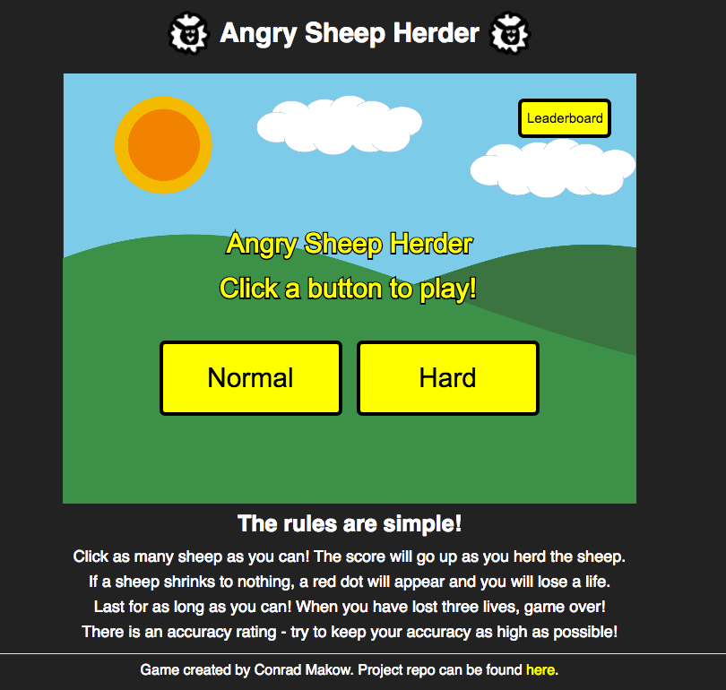

# Angry Sheep Herder

Angry Sheep Herder is a game used to practice and improve mouse accuracy and/or warmup mouse movements for other games. It is inspired by the game AimBooster. The goal of the game is to click as many sheep as possible without letting 3 sheep escape, or shrink to nothing.



[Live](http://conradmakow.com/AngrySheepHerder/)

## Instructions

To play, simply click to normal or hard mode. The normal mode features stationary targets while the hard mode has the targets moving in random directions at random velocity. If you set a high score, you will be prompted to enter a username and should hit enter to save the high score.

## Technologies

- JavaScript
- HTML5 Canvas

No additional game libraries were used. Everything was implemented through native JavaScript DOM manipulation and HTML5 canvas.

## Features and Implementation

### Increasing Spawn Rate

The sheep spawn at increasing rates as the game goes on due to a `setInterval` that reduces the interval for the spawn rate. Since a `setInterval` always happens at the same interval is started at, even if the interval passed is a variable that changes afterwards, I had to recursively call `setTimeout` with the decreasing interval to get the increasing spawn rate to work. The interval starts at 500 or 0.5 seconds and decreases to 0.25 seconds over 50 seconds. Both of these numbers can be changed quite easily by modifying `endInterval` or `interval` in an options hash when making the new game.

```JavaScript
//GameView class
this.diffInterval = setInterval(this.game.incrementDifficulty, 10000);

//Game class
incrementDifficulty() {
  if(this.interval === this.endInterval) {
    return null;
  } else {
    this.interval -= 50;
  }
}

sheepAdder() {
  this.addSheep(new Sheep({moving: this.moving}));
  if(this.lives > 0) {
    setTimeout(this.sheepAdder, this.interval)
  }
}
```

### Difficulty Setting

The difficulty is set through a `moving` boolean in the game class. The click handler is designed on the main menu so that if the user clicks on the hard button, a game is initiated with moving set to true, while if the normal button is clicked, moving is set to false. The `moving` boolean is passed to the sheep as shown in the code snippet above and the sheep check if they are moving before calling the move function. The sheep choose a random direction between zero and 2 PI and this is then converted into x and y increments.

```JavaScript
generateRandomDirection() {
  return (Math.random() * Math.PI * 2) // returns random angle between 0 and 2pi
}

generateRandomVelocity() {
  return Math.random() * 3;
}

this.direction = this.generateRandomDirection();
this.xInc = this.velocity * Math.cos(this.direction);
this.yInc = this.velocity * Math.sin(this.direction);
```
The velocity is a random number between 0 and 3, which can be modified to make the game more difficult or easy.

### High Scores

The high scores are implemented using a firebase database for persistence. When the game is begun a request is sent to the database to fetch the scores and retain the top 10 to render on the leaderboards. When a game is played, the score result is compared with the lowest score in the high scores and, if it is higher, the user will be prompted to enter their username for the leaderboards or press play again to submit it anonymously. After each score is submitted the scores are re-fetched so that the leaderboards update live.

## Future Features

1. Add training modes in which user can input settings and create a different game type.
2. Add more targets.
